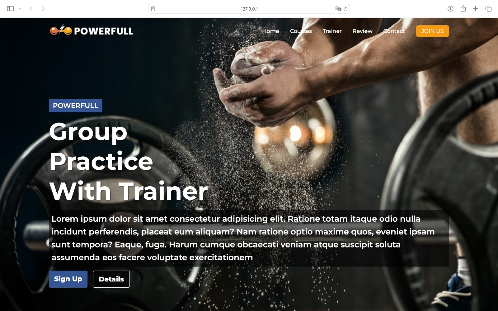
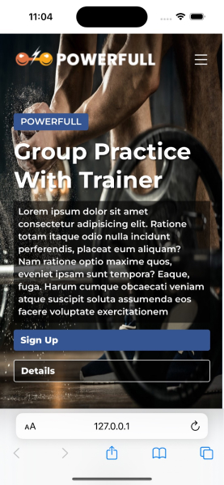

# Sport Center React Project

SportCenter is a modern web application developed using React, aimed at helping users explore fitness classes, calculate their BMI, and get information about the available group and solo training options at a sports center. It includes features such as a responsive navigation bar, class sections, and a BMI calculator for tracking health.

**Website url**: https://serene-mooncake-9f6b34.netlify.app

## Features
- **BMI Calculator**: Allows users to calculate their Body Mass Index (BMI) based on height and weight.
- **React**: The project leverages React for dynamic UI.
- **Responsive design**

## Technologies Used

- **React**: A JavaScript library for building user interfaces.
- **JavaScript (ES6+)**: Used for functionality such as state management and event handling.
- **HTML5 & CSS3**: For structuring and styling the project.
- **GitHub**: Version control for project management.

## License

This project is licensed under the MIT License.